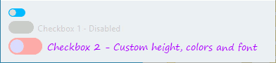

# Customizable QToggle Switch for PyQt6

This PyQt6 extension introduces a custom QToggle class, which is a visually appealing and customizable toggle switch derived from QCheckBox. The QToggle class features smooth transitions when toggling between states and offers several properties to modify the appearance, including colors and fonts.

## Features
- Customizable colors for toggle background, circle, active state, disabled state, and text
- Smooth transitions between states
- Disabled state support
- Easily adjustable height, colors, and font

## Usage
1. Import the `QToggle` class from the provided code.
2. Create an instance of `QToggle` and customize its properties as needed (colors, fonts, height).
3. Add the `QToggle` instance to your application's layout.

For a complete example, see the provided code which demonstrates how to use `QToggle` in a PyQt6 application.

## License
This project is licensed under the GNU Lesser General Public License v3.0. See the [LICENSE](LICENSE) file for details.